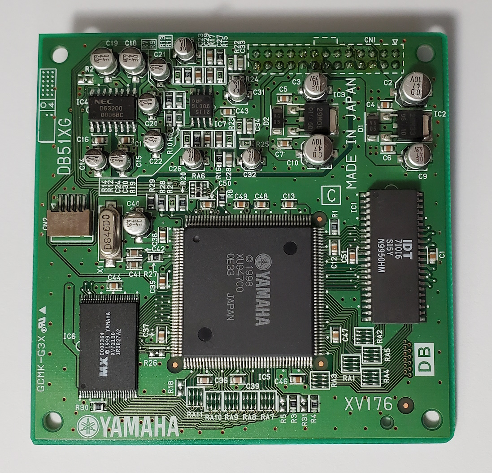

# Yamaha DB51XG CN2 Connector

The Yamaha DB51XG is a wavetable daughterboard that has the standard WaveBlaster 26-pin connector.

 

However, it also has a small second connector labeled as CN2 that.  In short, it provides digital audio output in contrast to the analog audio sent over the WaveBlaster connector.

 

 

Summary:

- 22-bit stereo digital output at 44.1 KHz.
- 5 volt compatible
- Output only (no signals are input to the board)
- Signalling is similar to I2S but not compatible
- Ground is provided, but not power.

## Pinout

The silkscreened triangle on the board indicates pin 1.

Pin | Name
----|-----
1   | `Data`
2   | `L/~R Clock`
3   | `CLK`
4   | `High-speed Clock`
5   | `Ground`

## Technical Details

To understand the CN2 connector, it is also necessary to understand the A/D chip, the NEC D63200 (aka uPD63200).  This chip receives similar data, *but not identical*, as is sent out of the CN2 connector.  This is because both parts share the same `CLK` and `L/~R Clock` signals.  Datasheets for the D63200 exist in Japanese and English as published by NEC and Renesas Technology who later purchased a portion of NEC.

The DB51XG has configured the D63200 to use 1 of its input pin for data for both left and right channels of audio (rather than 2 separate pins) and as 18-bits per sample per channel.  This is done via some of the D63200 pins being permanently pulled low or high by the board.

`CLK` runs continuously at 2.8224 MHz for both CN2 and the D63200.  The D63200 samples other inputs on the rising edge of `CLK`.  This clock runs even when the board is held in reset.

`L/~R Clock` runs at 44.100 KHz, which is 1/64th the speed of `CLK`.  This results in 32 `CLK` cycles while `L/~R Clock` is high and another 32 `CLK` cycles while it is low.  For the D63200, `L/~R Clock` is high when the left channel data is being sent to the D63200 and low when the right channel data is being sent.  Note that the D63200 datasheet refers to this signal as `LRCK`.  As above, this clock runs even when the board is held in reset.

The D63200 receives its audio data bits via a different signal than the CN2.  The D63200 datasheet refers to this signal as `SI`.  The data bits for the D63200 are transmited as follows:

- Starting at a `L/~R Clock` edge transition, for the 1st 14 `CLK` cycles the D63200's `SI` signal is 0.  These data bits are ignored by the D63200.
- For the next 18 `CLK` cycles starting at the 15th `CLK` cycle, the `SI` signal is the audio data sample for the left or the right channel.  It is an 18-bit signed number transmitted MSB (most significant bit) first.  Thus, the `SI` signal is the sign bit during the 15th `CLK` cycle and is the number's LSB during the 32nd `CLK` cycle.  The LSB (least significant bit) is sent just before the `L/~R Clock` edge transitions.

The CN2's pin 1 data signal differs from the D63200's data signal in the following ways:

- The 1st bit of data is transmitted on the 15th `CLK` cycle after an `L/~R Clock` edge transition, same as the D63200.  However, it is a *24-bit* signed number that is sent *LSB* first.  However, 2 of these bit are hardcoded as zero so only 22-bits actually change over time.
- The first 2 bits sent during the 15th and 16th `CLK` cycle are always 0.
- The next bit sent during the 17th `CLK` is the LSB bit of the number that changes value.
- The next 15 bits of data are sent before the next `L/~R Clock` edge transition during `CLK` cycles 18 thru 32.
- The final 6 bits of data for the channel are sent *after* `L/~R Clock` transitions for `CLK` cycles 1 thru 6.  Thus, these bits are transmitted while `L/~R Clock` indicates the *opposite* channel.  The 6th `CLK` cycle is the number's sign bit.
- For the remaining `CLK` cycles 7 through 14, the data is a copy of the sign bit.

The CN2's `High-speed Clock` runs at 16.9344 MHz.  This is 6x the speed of `CLK` and 384x the speed of `L/~R Clock`.  As with the other clocks, this clock runs even when the board is held in reset.

 

In the above image:

- Top green trace is CN2 `High-speed Clock`
- Next is CN2 `CLK`
- Next is CN2 `L/~R Clock`
- Next is CN2 `Data`
- Next is D63200 `L/~R Clock` (aka `LRCK`)
- Next is D63200 `Data` (aka `SI`)
- Bottom red trace is D63200 `CLK`
- Dashed vertical white line shows the start of the 1st data bit for both the D63200 and CN2.  This data is for the right channel since `L/~R Clock` is low.
- Solid vertical white line shows the end of the 24th data bit for the CN2.  This data is also for the right channel even though the `L/~R Clock` is high.
